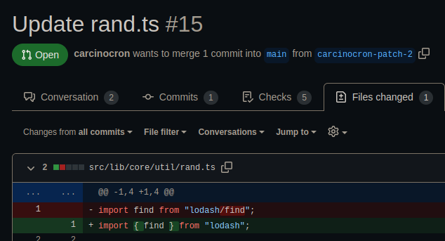
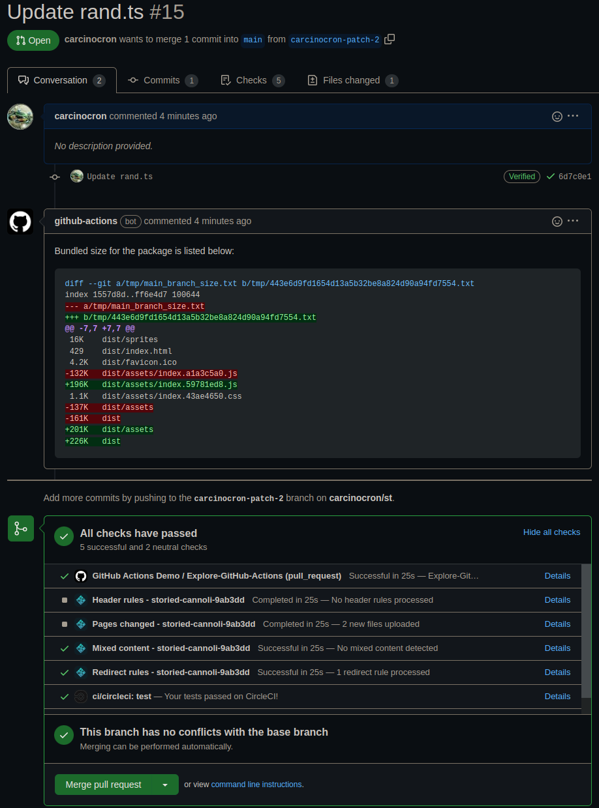

# JS bundle size
Github action for comparing javascript bundle size.
See if your build size changed significantly as a github-actions comment
on a pull request (or commit).

## Usage:

Checkout [example.yml](./example.yml)

A user makes a pull request with an unknowingly bad change:

Get a comment warning of a possible increase in your build size on the pull request:

## License
The scripts and documentation in this project are released under the [MIT License](./LICENSE)
